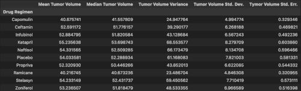

# matplotlib-challenge

## Background
249 mice identified with SCC tumors received treatment with a range of drug regimines, for the purposes of comparing the performance of Pymaceutical's drug of interest, Capomulin, against other treatment regimenes.

## Analysis Summary
### Prepare the Data
* Cleaned dataframe by removing mouse ID data with duplicate time points, resulting in an updated number of unique mice IDs of 248.

    

### Generate Summary Statistics
* Generated a summary dataframe indexed by drug regimen with columns of the following tumor volume statistics: mean, median, variance, standard deviation, and SEM.

    

### Create Bar Charts and Pie Charts
* Illustrated total number of rows (Mouse ID/Timepoints) for each drug regimen throughout the study via bar chart.

    

* Illustrated distribution of unique mice gender in the study via pie chart.

    

### Calculate Quartiles, Find Outliers, and Create a Box Plot
* Determined potential outliers in final tumor volume for each of the promising treatment regimens. A potential outlier of final tumor volume of 36.32mm3 was identfied in the Infubinol drug regimen group.
* Illustrated distribution of final tumor volume for all mice in each of the four of the most promising treatment regimens (Capomulin, Ramicane, Infubinol, and Ceftamin) via adjacent boxplots generated at scale.

    

### Create a Line Plot and a Scatter Plot
* Selected a random single mouse treated with Capolmulin and generated a line plot of tumor volume versus timepoint, to illustrate the tumor development of a random mouse treated with Capolmulin over regular timepoints.

    

* Generated a scatter plot of mouse weight versus average tumor volume for the entire Capomulin treatment regimen, to illustrate any relationship between mouse weight and average tumor volume for mice treated with Capolmulin.

    

### Calculate Correlation and Regression
* Calculated correlatiion between mouse weight and average tumor volume for mice treated with Capolmulin. A correlation coefficient of 0.84 suggests a strong postive correlation between the two variables.
* Calculated linear regression for mouse weight and average tumor volume for mice treated with Capolmulin, to model the relationship of how average tumor volume changes when weight of mice treated with Capolmulin are varied.

    

## Observations
* Of the 10 drug regimens observed in the study, the top 5 promising regimens in terms of mean and median tumor volume in ascending order are Ramicane, Capomulin, Propriva, Ceftamin, and Infubinol. These drugs, in their respective order, also appear to be the top 5 consistent regimens as demonstrated by lower tumor volume standard deviations. Propriva as a drug regimen in this study, however, has a tumor volume SEM higher than the other top 5; in addition, the number of observed mouse timepoints was the lowest for Propriva amongst all drug regimens included within the study. Thus, Propriva was left out of futher visualisations and analysis, as a greater number of observed mouse timepoints for this regimen may be required for the sample mean to become more representative of the population mean.

* The final tumor volume of mice treated with Capomulin and Ramicane tend to be significantly lower then the final tumor volume of mice treated with Infubinol and Ceftamin as illustrated by the box plots of final tumor volumes by promising treatment regimens.

* A correlation coefficient of 0.84 between mice weight and average tumor volume for mice treated with Capomulin suggests heavier mice undergoing Capomulin treatment are likely to exhibit larger tumor volumes on average throughout the treatment.
